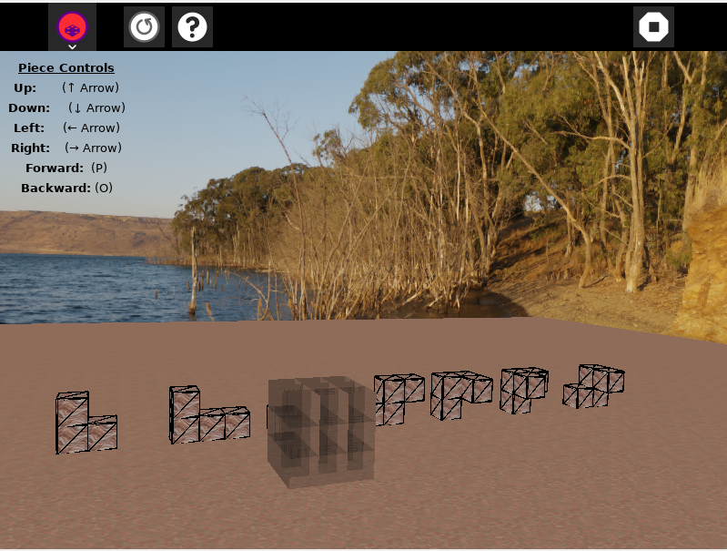
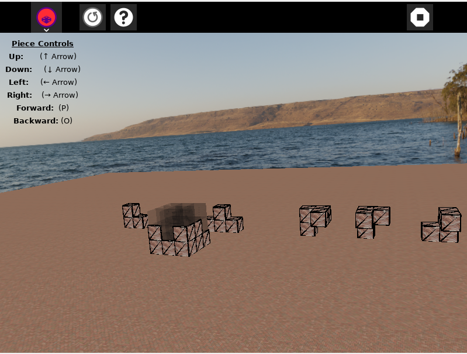

# Soma Cubes 3D Puzzle


## 🎯 Overview

Soma Cubes 3D Puzzle is an immersive puzzle game inspired by the classic Soma Cube challenge. Players must strategically arrange seven distinct 3D geometric pieces to fill target shapes in a dynamic 3D environment. This game masterfully combines spatial reasoning, strategic thinking, and problem-solving skills to create an engaging and educational gaming experience.



## 🎮 How to Play

1. **Target Shape**: You'll be presented with a 3D target shape to fill
2. **Seven Pieces**: Use all seven unique Soma cube pieces (made of unit cubes)
3. **Rotate & Position**: Manipulate pieces in 3D space - rotate, flip, and position them
4. **Perfect Fit**: Arrange all pieces to completely fill the target shape with no gaps or overlaps
5. **Complete the Puzzle**: Successfully fill the entire target shape to win!



## How to Use

For a step-by-step walkthrough, see the official documentation on installing activities:

[How to Install Activities – Sugar Labs Wiki](https://wiki.sugarlabs.org/go/How_to_install_activities)

Alternatively, for development or testing purposes, you may clone or copy the activity directory into your `~/Activities` folder and then restart Sugar to have it appear in the activity ring:

```bash
git clone <repository-url> ~/Activities/<activity-name>

cp -r /path/to/local/activity ~/Activities/
```