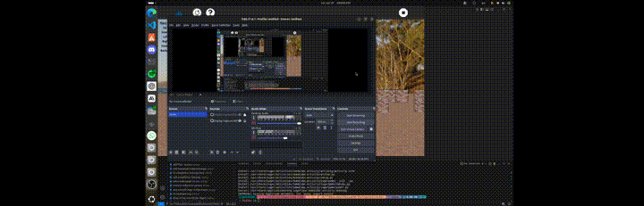

# Soma Cube

A Python-based OpenGL application for visualizing and exploring the classic **Soma Cube** — a 3×3×3 puzzle made up of seven unique pieces.

---

## Features

- Interactive 3D rendering of Soma Cube pieces using OpenGL.
- Mouse/keyboard controls to rotate and manipulate the cube.
- Includes demo/help animations (`help.gif`, `help.mp4`) to guide users.

---

## Dependencies

Ensure you have the following installed:

- **Python 3.6+**
- **PyOpenGL** – for 3D graphics support
- **Pillow (PIL)** – for loading textures (PNG images like `LakeCubeMap.png`, `Onyx.png`, etc.)
- *(Optional)* **Sugar3** – if running in a Sugar environment (repo includes `sugargame/`)  

Install via pip:

```bash
pip install PyOpenGL Pillow
```

## Installation
Clone the repo and install:
```bash
git clone https://github.com/Bishoywadea/Soma-Cube.git
cd Soma-Cube
pip install .
sudo python setup.py install
```

## Demonstration

Get a quick overview of the application:

  
*Interactive demo showing basic interaction.*

[](https://youtu.be/Q4BKp3Yo3Uw)

---

## License

This project is licensed under **GPL‑3.0**.